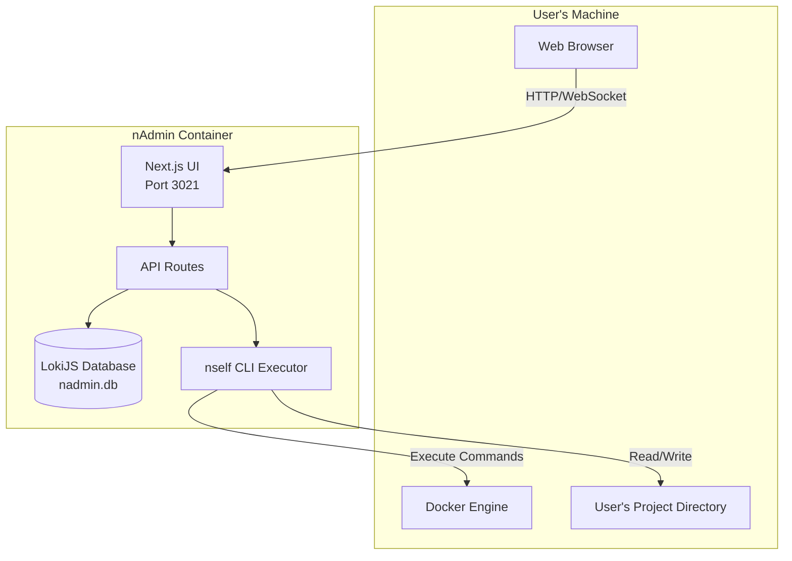
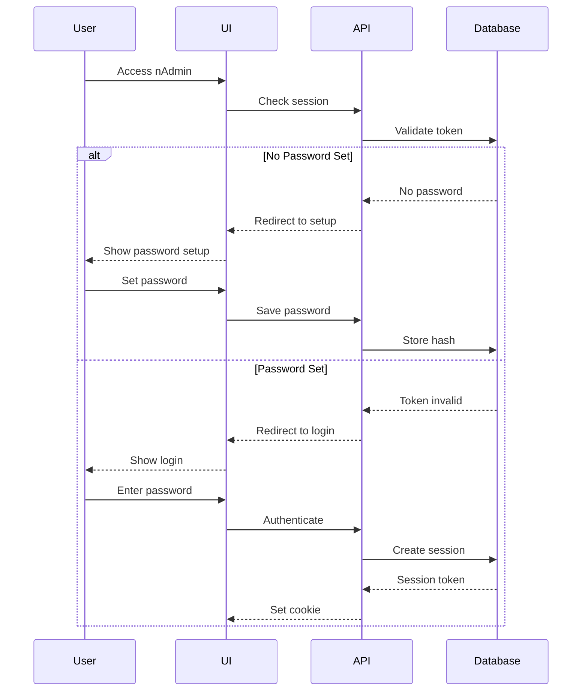
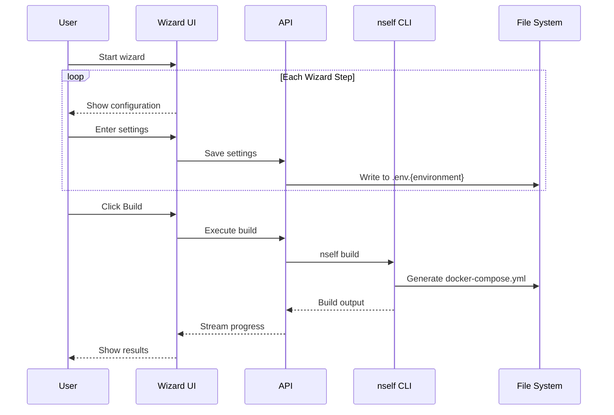
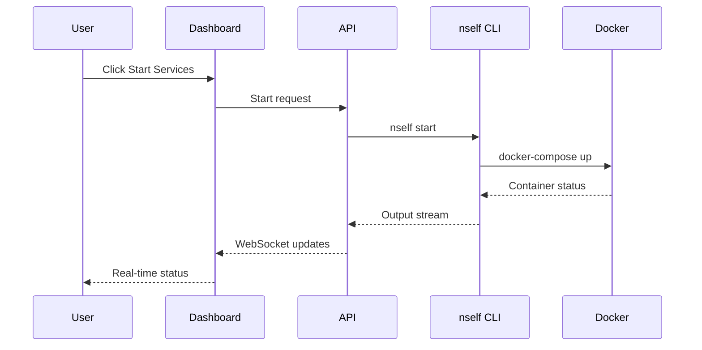
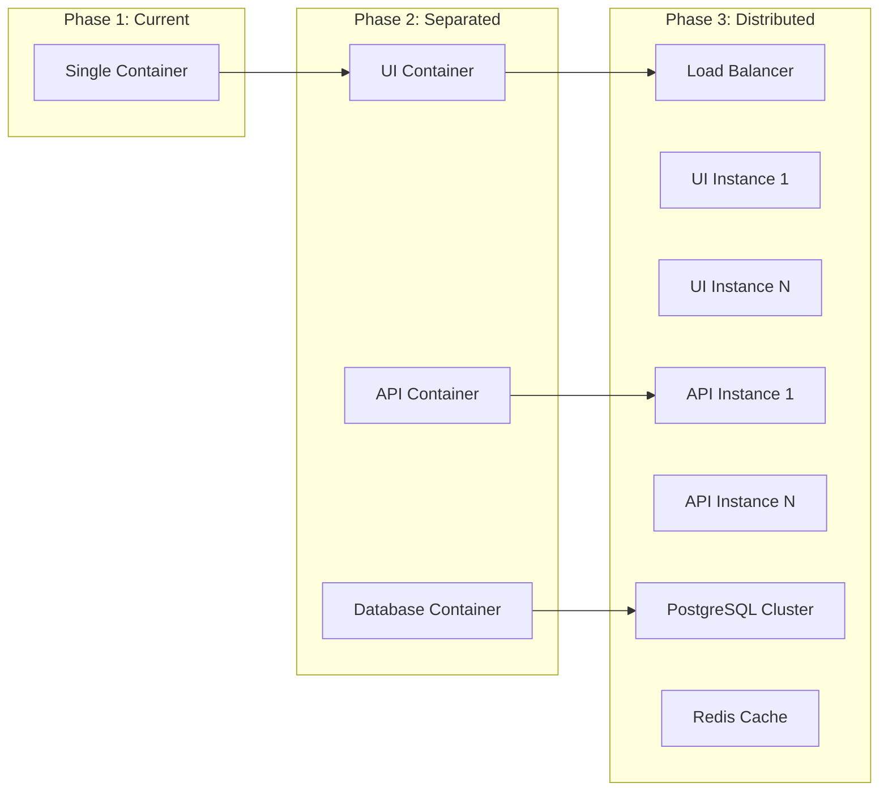

# nself Admin Architecture

## Overview

nself Admin (nAdmin) is a web-based UI wrapper for the nself CLI tool. It provides a visual interface for managing development stacks without reimplementing the core logic - all operations delegate to the nself CLI.

## Core Principles

1. **UI Wrapper Philosophy**: nAdmin is NOT a standalone implementation. It delegates all operations to the nself CLI (`~/Sites/nself`)
2. **Zero Footprint**: Never pollutes the user's project directory
3. **Self-Contained**: All state in database, no external dependencies
4. **Docker-First**: Designed to run in container, local dev is secondary
5. **Progressive Disclosure**: Guide users through setup → build → start → manage

## System Architecture



## Component Architecture

### Frontend (Next.js 15)

```
src/app/
├── (auth)/
│   └── login/          # Authentication & password setup
├── (setup)/
│   ├── build/          # Project setup wizard
│   └── start/          # Service startup
├── (dashboard)/
│   ├── page.tsx        # Main dashboard
│   ├── services/       # Service management
│   ├── database/       # Database tools
│   └── config/         # Configuration
└── api/                # API routes
```

### Backend (API Routes)

```
src/app/api/
├── auth/               # Authentication endpoints
├── setup/              # Setup & configuration
├── wizard/             # Wizard operations
├── nself/              # CLI command execution
├── docker/             # Docker operations
└── monitoring/         # Health & metrics
```

### Core Libraries

```
src/lib/
├── database.ts         # LokiJS interface
├── auth-db.ts          # Authentication logic
├── project-utils.ts    # Project detection
├── nself-cli.ts        # CLI executor
├── paths.ts            # Centralized path resolution
└── env-validation.ts   # Environment validation
```

## Data Flow

### 1. Authentication Flow



### 2. Project Setup Flow



### 3. Service Management Flow



## Database Schema

### LokiJS Collections

```javascript
// config collection
{
  key: string,          // e.g., "admin_password_hash"
  value: any,           // Configuration value
  updatedAt: Date
}

// sessions collection
{
  token: string,        // Session token
  userId: string,       // Always "admin" for now
  expiresAt: Date,      // TTL timestamp
  ip: string,           // Client IP
  userAgent: string     // Browser info
}

// project_cache collection
{
  key: string,          // Cache key
  value: any,           // Cached data
  cachedAt: Date        // Cache timestamp
}

// audit_log collection
{
  action: string,       // e.g., "login_attempt"
  timestamp: Date,
  success: boolean,
  details: object,
  ip: string
}
```

## Path Resolution

All path resolution is centralized in `src/lib/paths.ts`:

```typescript
export function getProjectPath(): string {
  // Priority order:
  // 1. NSELF_PROJECT_PATH env var
  // 2. PROJECT_PATH env var (legacy)
  // 3. Default: ../nself-project (dev) or /workspace (prod)

  let projectPath =
    process.env.NSELF_PROJECT_PATH ||
    process.env.PROJECT_PATH ||
    '../nself-project'

  // Handle tilde expansion
  if (projectPath.startsWith('~')) {
    projectPath = projectPath.replace(/^~/, os.homedir())
  }

  // Resolve relative paths
  if (!projectPath.startsWith('/')) {
    if (process.env.NODE_ENV === 'development') {
      return path.resolve(process.cwd(), projectPath)
    }
    return `/app/${projectPath}`
  }

  return projectPath
}
```

## Security Architecture

### Password Management

- Passwords hashed with bcrypt (10 rounds)
- Stored in database, not environment variables
- Minimum requirements vary by environment:
  - Development: 3 characters
  - Production: 12 chars, uppercase, lowercase, number, special

### Session Management

- JWT tokens with 24-hour TTL
- Stored in httpOnly cookies
- Sessions validated against database
- Automatic cleanup of expired sessions

### Container Isolation

```dockerfile
# Run as non-root user
USER node

# Read-only root filesystem
# Only /app/data is writable (database)

# Capabilities dropped
# Only required: network, file I/O
```

## Deployment Architecture

### Docker Deployment

```bash
docker run -d \
  --name nself-admin \
  -p 3021:3021 \
  -v /user/project:/workspace:rw \
  -v /var/run/docker.sock:/var/run/docker.sock \
  -v nself-admin-data:/app/data \
  acamarata/nself-admin:latest
```

**Volume Mounts:**

- `/workspace`: User's project (read-write)
- `/var/run/docker.sock`: Docker control
- `/app/data`: Persistent database

### Kubernetes Deployment

```yaml
apiVersion: apps/v1
kind: Deployment
metadata:
  name: nself-admin
spec:
  template:
    spec:
      containers:
        - name: nself-admin
          image: acamarata/nself-admin:latest
          ports:
            - containerPort: 3021
          volumeMounts:
            - name: project
              mountPath: /workspace
            - name: docker-sock
              mountPath: /var/run/docker.sock
            - name: data
              mountPath: /app/data
```

## Performance Considerations

### Caching Strategy

- Project info cached for 5 minutes
- Docker stats cached for 10 seconds
- Template list cached indefinitely
- Environment configs cached until modified

### Resource Usage

- **Memory**: ~256MB runtime
- **CPU**: Minimal (<1% idle, spikes during builds)
- **Disk**: ~10MB database, logs rotated
- **Network**: WebSocket for real-time updates

### Optimization Techniques

1. **Lazy Loading**: Components loaded on demand
2. **Streaming**: CLI output streamed, not buffered
3. **Debouncing**: API calls debounced (300ms)
4. **Compression**: Brotli for static assets
5. **Connection Pooling**: Reuse Docker connections

## Error Handling

### Error Categories

1. **User Errors**: Invalid input, missing config
2. **System Errors**: Docker unavailable, disk full
3. **Network Errors**: Connection timeouts
4. **CLI Errors**: nself command failures

### Error Recovery

```typescript
// Retry logic for transient failures
async function executeWithRetry(fn, retries = 3) {
  for (let i = 0; i < retries; i++) {
    try {
      return await fn()
    } catch (error) {
      if (i === retries - 1) throw error
      await sleep(1000 * Math.pow(2, i)) // Exponential backoff
    }
  }
}
```

## Testing Architecture

### Unit Tests

```typescript
// Example: Path resolution test
describe('getProjectPath', () => {
  it('handles tilde expansion', () => {
    process.env.NSELF_PROJECT_PATH = '~/project'
    expect(getProjectPath()).toBe('/Users/admin/project')
  })
})
```

### Integration Tests

```typescript
// Example: API endpoint test
describe('POST /api/auth/login', () => {
  it('creates session on valid password', async () => {
    const response = await request(app)
      .post('/api/auth/login')
      .send({ password: 'valid-password' })

    expect(response.status).toBe(200)
    expect(response.headers['set-cookie']).toBeDefined()
  })
})
```

### E2E Tests

```typescript
// Example: Full wizard flow
describe('Project Setup', () => {
  it('completes wizard and builds project', async () => {
    await page.goto('http://localhost:3021')
    await page.fill('#password', 'test-password')
    await page.click('#setup-button')
    // ... continue through wizard
    await expect(page).toHaveURL('/dashboard')
  })
})
```

## Monitoring & Observability

### Health Checks

```typescript
// Health endpoint
GET /api/health

{
  "status": "healthy",
  "checks": {
    "database": "ok",
    "docker": "ok",
    "filesystem": "ok"
  },
  "uptime": 3600,
  "version": "0.0.4"
}
```

### Metrics Collection

- Request latency (p50, p95, p99)
- Error rates by endpoint
- Active sessions count
- Build success/failure rate
- Container resource usage

### Logging

```typescript
// Structured logging
logger.info('Build started', {
  project: projectPath,
  environment: 'dev',
  timestamp: new Date().toISOString(),
})
```

## Future Architecture Considerations

### Planned Enhancements

1. **Multi-User Support**
   - User management service
   - Role-based access control
   - Team workspaces

2. **Distributed Architecture**
   - Separate API server
   - Multiple UI instances
   - Shared database (PostgreSQL)

3. **Plugin System**
   - Custom service templates
   - UI extensions
   - Webhook integrations

4. **Cloud Native**
   - Kubernetes operators
   - Helm charts
   - Cloud provider integrations

### Scalability Path



## Contributing

See [CONTRIBUTING.md](CONTRIBUTING.md) for development setup and guidelines.

## License

MIT License - See [LICENSE](LICENSE) for details.
