# Architecture Overview

Comprehensive guide to nself Admin's architecture, design principles, and technical implementation.

## Table of Contents

- [System Overview](#system-overview)
- [Component Architecture](#component-architecture)
- [Data Flow](#data-flow)
- [Security Model](#security-model)
- [Storage Systems](#storage-systems)
- [API Design](#api-design)
- [Frontend Architecture](#frontend-architecture)
- [Docker Integration](#docker-integration)
- [Scalability Considerations](#scalability-considerations)
- [Performance Optimizations](#performance-optimizations)

## System Overview

nself Admin is designed as a **UI wrapper** that provides a web interface for the nself CLI. It follows a container-first architecture with zero footprint on user projects.

### Key Design Principles

1. **Zero Footprint**: Never pollutes user's project directory
2. **Self-Contained**: All state in embedded database
3. **Docker-First**: Designed to run in containers
4. **Progressive Disclosure**: Guides users through setup → build → start → manage
5. **CLI Delegation**: All operations delegate to nself CLI

### High-Level Architecture

```mermaid
graph TB
    subgraph "User Environment"
        User[👤 User]
        Browser[🌐 Browser]
        Project[📁 User Project]
    end

    subgraph "nself Admin Container"
        UI[⚛️ Next.js UI]
        API[🔌 API Routes]
        DB[💾 LokiJS DB]
        CLI[🛠️ nself CLI]
    end

    subgraph "Docker Host"
        Engine[🐳 Docker Engine]
        Services[⚙️ User Services]
        Volumes[💿 Docker Volumes]
    end

    User --> Browser
    Browser --> UI
    UI --> API
    API --> DB
    API --> CLI
    CLI --> Engine
    Engine --> Services
    Services --> Volumes

    Project -.-> CLI
    Engine -.-> Project
```



## Component Architecture

### Frontend Layer (Next.js)

```
src/app/
├── (auth)/                 # Authentication pages
│   ├── login/             # Login & password setup
│   └── layout.tsx         # Auth layout
├── (dashboard)/           # Main application
│   ├── page.tsx          # Dashboard home
│   ├── services/         # Service management
│   ├── database/         # Database tools
│   ├── config/           # Configuration
│   ├── monitor/          # Monitoring
│   └── layout.tsx        # Dashboard layout
├── (wizard)/             # Setup wizard
│   ├── build/            # Project build
│   ├── start/            # Service startup
│   └── init/             # 6-step wizard
├── api/                  # API routes
│   ├── auth/            # Authentication
│   ├── project/         # Project operations
│   ├── services/        # Service management
│   ├── docker/          # Docker operations
│   └── system/          # System info
└── components/           # Shared components
    ├── ui/              # Base UI components
    ├── forms/           # Form components
    └── charts/          # Visualization
```

### Backend Layer (API Routes)

```typescript
// API Route Structure
interface APIRoute {
  GET?:    (req: Request) => Response    // Read operations
  POST?:   (req: Request) => Response    // Create operations
  PUT?:    (req: Request) => Response    // Update operations
  DELETE?: (req: Request) => Response    // Delete operations
}

// Middleware Stack
Request → Auth Check → Rate Limit → Handler → Response
```

### Database Layer (LokiJS)

```javascript
// Database Schema
const schema = {
  config: [
    { key: 'admin_password_hash', value: '$2b$...' },
    { key: 'setup_completed', value: true }
  ],
  sessions: [
    { token: '...', userId: 'admin', expiresAt: '...', ip: '...' }
  ],
  project_cache: [
    { key: 'services', value: [...], cachedAt: '...' }
  ],
  audit_log: [
    { action: 'login_attempt', timestamp: '...', success: true }
  ]
}
```

## Data Flow

### Authentication Flow


### Project Operations Flow


### Real-time Updates Flow


## Security Model

### Authentication & Authorization

```typescript
// Security Layers
interface SecurityLayer {
  authentication: 'JWT-based sessions'
  authorization: 'Admin-only access'
  sessionManagement: '24-hour TTL'
  passwordHashing: 'bcrypt with salt'
  csrfProtection: 'Token validation'
  auditLogging: '30-day retention'
}
```

### Security Implementation

```typescript
// Password Requirements
interface PasswordPolicy {
  development: {
    minLength: 3
    requirements: 'Any characters'
  }
  production: {
    minLength: 12
    requirements: 'Uppercase, lowercase, number, special'
    complexity: true
  }
}

// Session Security
interface SessionSecurity {
  storage: 'httpOnly cookies'
  expiry: '24 hours'
  renewal: 'Sliding window'
  invalidation: 'Logout/timeout'
}
```

### Security Boundaries

```
┌─────────────────────────────────────┐
│              Internet               │
└────────────┬────────────────────────┘
             │ HTTPS (Port 3021)
┌────────────▼────────────────────────┐
│        Nginx Proxy (Future)        │
└────────────┬────────────────────────┘
             │
┌────────────▼────────────────────────┐
│       nAdmin Container              │
│  ┌──────────────────────────────┐   │
│  │    Authentication Layer      │   │
│  ├──────────────────────────────┤   │
│  │     Application Layer        │   │
│  ├──────────────────────────────┤   │
│  │     Database Layer           │   │
│  └──────────────────────────────┘   │
└─────────────┬───────────────────────┘
              │ Docker Socket
┌─────────────▼───────────────────────┐
│         Docker Engine               │
└─────────────────────────────────────┘
```

## Storage Systems

### Application Database (LokiJS)

```javascript
// Database Configuration
const dbConfig = {
  filename: '/app/data/nadmin.db',
  autoload: true,
  autosave: true,
  autosaveInterval: 30000, // 30 seconds
  adapter: new LokiFSAdapter(),
  verbose: false,

  // TTL Configuration
  ttl: {
    sessions: 24 * 60 * 60 * 1000, // 24 hours
    cache: 5 * 60 * 1000, // 5 minutes
    audit: 30 * 24 * 60 * 60 * 1000, // 30 days
  },
}
```

### File System Structure

```
/app/                     # Container filesystem
├── data/                # Persistent data
│   └── nadmin.db       # LokiJS database
├── src/                 # Application code
└── public/             # Static assets

/workspace/              # Mounted user project
├── docker-compose.yml  # Generated by nself CLI
├── .env.development    # Environment config
├── services/           # Custom services
└── data/              # Service data
```

### Volume Management

```yaml
# Docker volume strategy
volumes:
  # Application data (persistent)
  nself-admin-data:
    driver: local

  # User project (bind mount)
  user-project:
    type: bind
    source: /path/to/project
    target: /workspace

  # Docker socket (system)
  docker-socket:
    type: bind
    source: /var/run/docker.sock
    target: /var/run/docker.sock
```

## API Design

### RESTful Conventions

```typescript
// API Structure
interface APIEndpoint {
  path: string
  method: 'GET' | 'POST' | 'PUT' | 'DELETE'
  auth: boolean
  rateLimit: number
  description: string
}

const endpoints: APIEndpoint[] = [
  {
    path: '/api/auth/login',
    method: 'POST',
    auth: false,
    rateLimit: 5, // per minute
    description: 'Authenticate user',
  },
  {
    path: '/api/services',
    method: 'GET',
    auth: true,
    rateLimit: 60,
    description: 'List services',
  },
]
```

### Response Format

```typescript
// Standardized API Response
interface APIResponse<T> {
  success: boolean
  data?: T
  error?: {
    code: string
    message: string
    details?: any
  }
  meta?: {
    timestamp: string
    version: string
    requestId: string
  }
}
```

### Error Handling

```typescript
// Error Classification
interface ErrorTypes {
  validation: 'Input validation failed'
  authentication: 'Invalid credentials'
  authorization: 'Access denied'
  notFound: 'Resource not found'
  conflict: 'Resource already exists'
  rateLimit: 'Too many requests'
  internal: 'Internal server error'
}
```

## Frontend Architecture

### Component Hierarchy

```
App (Layout)
├── AuthProvider
├── ThemeProvider
└── Router
    ├── LoginPage
    ├── WizardFlow
    │   ├── InitStep1-6
    │   ├── BuildPage
    │   └── StartPage
    └── Dashboard
        ├── Sidebar
        ├── TopBar
        └── MainContent
            ├── ServicesPage
            ├── DatabasePage
            ├── ConfigPage
            └── MonitorPage
```

### State Management

```typescript
// Global State Structure
interface AppState {
  auth: {
    isAuthenticated: boolean
    user: string | null
    token: string | null
  }
  project: {
    info: ProjectInfo | null
    services: Service[]
    status: 'idle' | 'loading' | 'error'
  }
  ui: {
    theme: 'light' | 'dark'
    sidebar: boolean
    loading: boolean
  }
}
```

### Data Fetching Strategy

```typescript
// SWR Configuration
const swrConfig = {
  fetcher: (url: string) => fetch(url).then((r) => r.json()),
  refreshInterval: 5000, // 5 seconds for real-time data
  revalidateOnFocus: true,
  revalidateOnReconnect: true,
  errorRetryCount: 3,
  dedupingInterval: 2000,
}
```

## Docker Integration

### Container Communication


### Docker API Usage

```typescript
// Docker Operations
interface DockerOperations {
  containers: {
    list: () => Container[]
    start: (id: string) => void
    stop: (id: string) => void
    restart: (id: string) => void
    logs: (id: string) => Stream
    stats: (id: string) => Stats
  }
  images: {
    list: () => Image[]
    pull: (name: string) => void
    remove: (id: string) => void
  }
  networks: {
    list: () => Network[]
    create: (config: NetworkConfig) => void
  }
}
```

### Resource Monitoring

```typescript
// Real-time Metrics Collection
interface MetricsCollector {
  interval: 5000 // 5 seconds
  sources: ['docker stats', 'docker ps', 'system metrics']
  aggregation: {
    cpu: 'percentage'
    memory: 'bytes + percentage'
    network: 'bytes/second'
    disk: 'bytes + iops'
  }
}
```

## Scalability Considerations

### Current Limitations

- **Single Instance**: One nAdmin per project
- **Local Docker**: Only manages local containers
- **No Clustering**: No multi-node support
- **Memory Bound**: LokiJS keeps data in memory

### Future Scalability

```typescript
// Planned Improvements
interface ScalabilityRoadmap {
  multiTenant: {
    userIsolation: 'Database namespaces'
    resourceLimits: 'Per-user quotas'
    projectSeparation: 'Isolated environments'
  }
  clustering: {
    loadBalancing: 'Multiple nAdmin instances'
    sharedState: 'External database'
    sessionReplication: 'Distributed sessions'
  }
  remoteDocker: {
    dockerContexts: 'Multiple Docker hosts'
    kubernetes: 'K8s API integration'
    cloudProviders: 'AWS/GCP/Azure'
  }
}
```

### Performance Targets

```yaml
Performance Goals:
  Response Time:
    API: < 200ms (95th percentile)
    UI: < 100ms (First Contentful Paint)
    Dashboard: < 2s (Full Load)

  Throughput:
    Concurrent Users: 10
    API Requests: 1000/minute
    WebSocket Connections: 50

  Resources:
    Memory: < 512MB
    CPU: < 25% (idle), < 80% (active)
    Disk: < 1GB total
```

## Performance Optimizations

### Frontend Optimizations

```typescript
// React Optimizations
interface FrontendOptimizations {
  codesplitting: 'Route-based lazy loading'
  memoization: 'React.memo, useMemo, useCallback'
  virtualization: 'Virtual scrolling for large lists'
  bundleOptimization: 'Tree shaking, minification'
  caching: 'Service worker, browser cache'
}
```

### API Optimizations

```typescript
// Backend Optimizations
interface BackendOptimizations {
  caching: {
    docker_stats: '5 seconds'
    project_info: '30 seconds'
    service_list: '10 seconds'
  }
  compression: 'gzip for API responses'
  pagination: 'Limit large datasets'
  pooling: 'Connection pooling'
}
```

### Database Optimizations

```typescript
// LokiJS Optimizations
interface DatabaseOptimizations {
  indexes: 'Create indexes on frequently queried fields'
  ttl: 'Auto-cleanup expired data'
  compaction: 'Periodic database compaction'
  batching: 'Batch multiple operations'
}
```

## Development Patterns

### Code Organization

```typescript
// Layered Architecture
interface LayerStructure {
  presentation: 'React components, pages'
  application: 'API routes, business logic'
  domain: 'Types, interfaces, utilities'
  infrastructure: 'Database, Docker, filesystem'
}
```

### Error Boundaries

```typescript
// Error Handling Strategy
interface ErrorStrategy {
  frontend: {
    componentErrors: 'React Error Boundaries'
    asyncErrors: 'Try-catch with user feedback'
    networkErrors: 'Retry mechanisms'
  }
  backend: {
    validation: 'Input validation with detailed errors'
    exceptions: 'Graceful error responses'
    logging: 'Structured error logging'
  }
}
```

### Testing Strategy

```typescript
// Testing Pyramid
interface TestingStrategy {
  unit: {
    components: 'React Testing Library'
    utilities: 'Jest unit tests'
    coverage: '> 80%'
  }
  integration: {
    api: 'API route testing'
    database: 'LokiJS operations'
    docker: 'Container interactions'
  }
  e2e: {
    flows: 'Playwright/Cypress'
    criticalPaths: 'Login, wizard, service management'
  }
}
```

## Deployment Architecture

### Container Strategy

```dockerfile
# Multi-stage build
FROM node:18-alpine AS builder
WORKDIR /app
COPY package*.json ./
RUN npm ci --only=production

FROM node:18-alpine AS runtime
WORKDIR /app
COPY --from=builder /app/node_modules ./node_modules
COPY . .
EXPOSE 3021
CMD ["npm", "start"]
```

### Production Considerations

```yaml
Production Setup:
  Security:
    - Run as non-root user
    - Read-only filesystem
    - Security scanning
    - Secret management

  Monitoring:
    - Health checks
    - Metrics collection
    - Log aggregation
    - Alerting

  Backup:
    - Database backups
    - Configuration backups
    - Disaster recovery
```

## Future Architecture Evolution

### Planned Improvements


### Technology Evolution

```typescript
// Future Technology Adoption
interface TechnologyRoadmap {
  current: {
    frontend: 'Next.js 15, React 18'
    backend: 'Next.js API Routes'
    database: 'LokiJS (embedded)'
    containerization: 'Docker'
  }
  planned: {
    frontend: 'Potential migration to Solid.js/Svelte'
    backend: 'Fastify/Express for better performance'
    database: 'SQLite → PostgreSQL for multi-user'
    orchestration: 'Kubernetes support'
  }
}
```

## Conclusion

nself Admin's architecture is designed for simplicity, security, and scalability. The current implementation focuses on single-user, single-project scenarios while maintaining extensibility for future multi-user and multi-project capabilities.

### Key Strengths

- **Zero Footprint**: Clean separation from user projects
- **Container Native**: Built for Docker-first workflows
- **Progressive Enhancement**: Guided user experience
- **Security Focused**: Multiple layers of protection
- **Developer Friendly**: Clear patterns and conventions

### Next Steps

- [**Deployment Guide**](Deployment-Guide) - Production deployment
- [**Security Guide**](Security-Guide) - Security best practices
- [**API Reference**](api/Reference) - Complete API documentation
- [**Contributing Guide**](Contributing) - Development guidelines

---

**Related Documentation**:

- [System Requirements](System-Requirements)
- [Environment Management](Environment-Management)
- [Performance Tuning](Performance-Tuning)
- [Troubleshooting](Troubleshooting)
