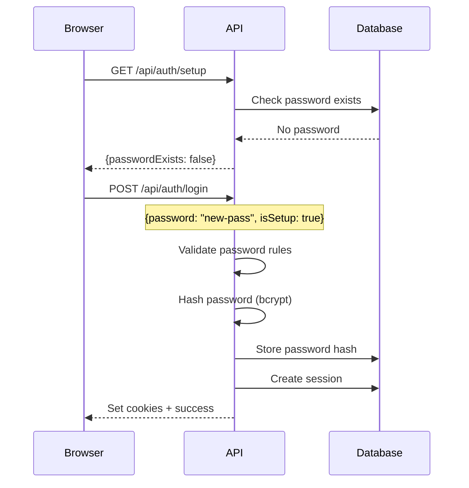
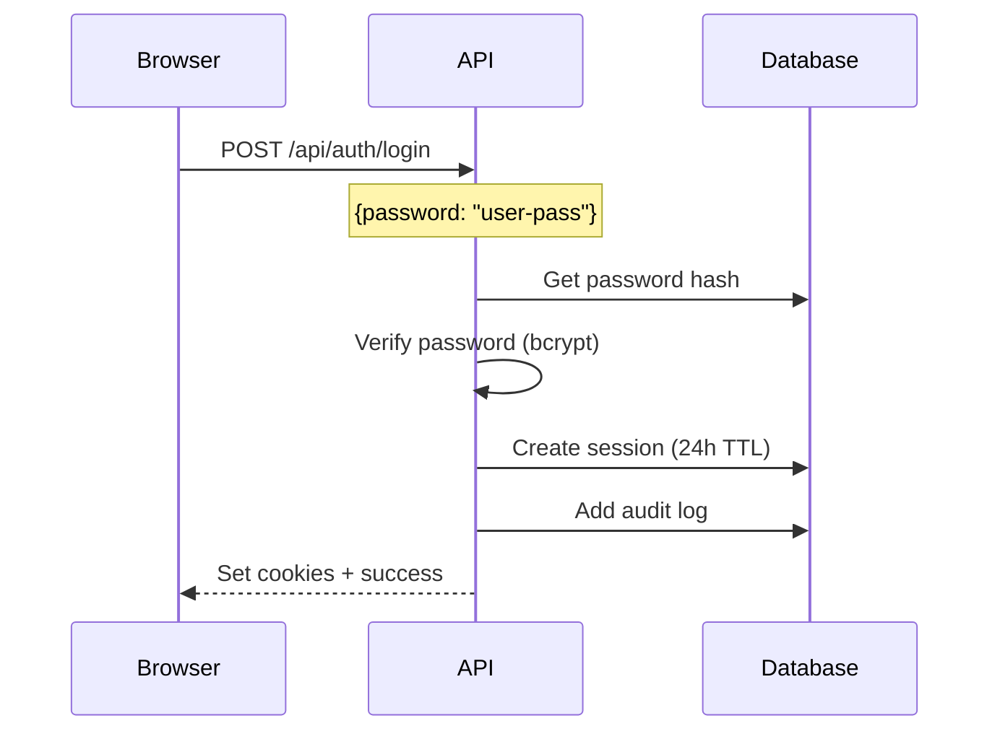
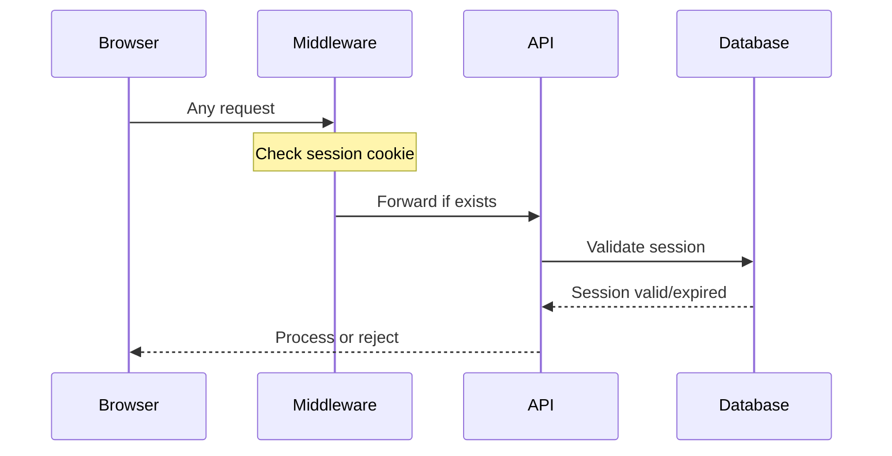

# Authentication API

## Overview

nAdmin uses session-based authentication with bcrypt password hashing and CSRF protection. All authentication state is stored in the LokiJS database.

## Endpoints

### POST /api/auth/setup

Check if initial password setup is required.

**Request**

```http
POST /api/auth/setup
Content-Type: application/json
```

**Response**

```json
{
  "passwordExists": false,
  "isDevEnv": true
}
```

**Status Codes**

- `200` - Success
- `500` - Server error

---

### POST /api/auth/login

Authenticate user and create session.

**Request**

```http
POST /api/auth/login
Content-Type: application/json

{
  "password": "your-password",
  "isSetup": false  // true for initial setup
}
```

**Response**

```json
{
  "success": true,
  "message": "Login successful"
}
```

**Headers Set**

```http
Set-Cookie: nself-session=<token>; HttpOnly; SameSite=Strict; Path=/; Max-Age=86400
Set-Cookie: nself-csrf=<token>; SameSite=Strict; Path=/; Max-Age=86400
```

**Status Codes**

- `200` - Login successful
- `400` - Invalid request or validation error
- `401` - Invalid credentials
- `500` - Server error

---

### GET /api/auth/check

Verify current session status.

**Request**

```http
GET /api/auth/check
Cookie: nself-session=<token>
```

**Response**

```json
{
  "authenticated": true,
  "userId": "admin",
  "sessionExpiry": "2024-01-21T10:00:00Z"
}
```

**Status Codes**

- `200` - Session valid
- `401` - No session or expired
- `500` - Server error

---

### POST /api/auth/logout

End current session.

**Request**

```http
POST /api/auth/logout
Cookie: nself-session=<token>
X-CSRF-Token: <csrf-token>
```

**Response**

```json
{
  "success": true,
  "message": "Logged out successfully"
}
```

**Headers Set**

```http
Set-Cookie: nself-session=; HttpOnly; Path=/; Max-Age=0
Set-Cookie: nself-csrf=; Path=/; Max-Age=0
```

**Status Codes**

- `200` - Logout successful
- `401` - Not authenticated
- `403` - CSRF token invalid
- `500` - Server error

---

### POST /api/auth/change-password

Change admin password (requires authentication).

**Request**

```http
POST /api/auth/change-password
Cookie: nself-session=<token>
X-CSRF-Token: <csrf-token>
Content-Type: application/json

{
  "currentPassword": "old-password",
  "newPassword": "new-password"
}
```

**Response**

```json
{
  "success": true,
  "message": "Password changed successfully"
}
```

**Status Codes**

- `200` - Password changed
- `400` - Validation error
- `401` - Not authenticated or wrong current password
- `403` - CSRF token invalid
- `500` - Server error

## Authentication Flow

### Initial Setup



### Regular Login



### Session Validation



## Security Features

### Password Requirements

#### Development Mode

- Minimum 3 characters
- No complexity requirements
- Detected by hostname patterns (localhost, \*.local, etc.)

#### Production Mode

- Minimum 12 characters
- Must contain:
  - Uppercase letter (A-Z)
  - Lowercase letter (a-z)
  - Number (0-9)
  - Special character (@$!%\*?&)

### Password Hashing

```typescript
// Bcrypt with 12 salt rounds
const SALT_ROUNDS = 12
const hash = await bcrypt.hash(password, SALT_ROUNDS)
```

### Session Management

#### Session Token

- Cryptographically random 32-byte token
- Stored as hex string (64 characters)
- Generated using Node.js crypto module

```typescript
const token = crypto.randomBytes(32).toString('hex')
```

#### Session Storage

- Server-side only (not in JWT)
- 24-hour TTL with automatic cleanup
- Includes IP and User-Agent for security

#### Cookie Settings

```typescript
// Session cookie (HttpOnly)
{
  httpOnly: true,
  secure: true,      // HTTPS only in production
  sameSite: 'strict',
  maxAge: 86400000,  // 24 hours
  path: '/'
}

// CSRF cookie (accessible to JS)
{
  httpOnly: false,
  secure: true,      // HTTPS only in production
  sameSite: 'strict',
  maxAge: 86400000,  // 24 hours
  path: '/'
}
```

### CSRF Protection

All state-changing requests require CSRF token:

1. Token generated on first visit
2. Stored in non-HttpOnly cookie
3. Must be sent as `X-CSRF-Token` header
4. Validated by middleware

```typescript
// Client-side
const csrfToken = document.cookie
  .split('; ')
  .find((row) => row.startsWith('nself-csrf='))
  ?.split('=')[1]

fetch('/api/auth/logout', {
  method: 'POST',
  headers: {
    'X-CSRF-Token': csrfToken,
  },
})
```

### Rate Limiting

Protection against brute force attacks:

- 5 login attempts per minute per IP
- 20 login attempts per hour per IP
- Exponential backoff on failures
- Audit log tracks all attempts

### Audit Logging

All authentication events logged:

```typescript
interface AuditLog {
  action: 'login_attempt' | 'login_success' | 'logout' | 'password_change'
  timestamp: Date
  userId?: string
  ip?: string
  userAgent?: string
  success: boolean
  details?: any
}
```

## Client Integration

### React Hook Example

```typescript
// hooks/useAuth.ts
export function useAuth() {
  const [isAuthenticated, setIsAuthenticated] = useState(false)
  const [loading, setLoading] = useState(true)

  useEffect(() => {
    checkAuth()
  }, [])

  const checkAuth = async () => {
    try {
      const res = await fetch('/api/auth/check')
      setIsAuthenticated(res.ok)
    } catch {
      setIsAuthenticated(false)
    } finally {
      setLoading(false)
    }
  }

  const login = async (password: string) => {
    const res = await fetch('/api/auth/login', {
      method: 'POST',
      headers: { 'Content-Type': 'application/json' },
      body: JSON.stringify({ password }),
    })

    if (res.ok) {
      setIsAuthenticated(true)
      return { success: true }
    }

    const error = await res.json()
    return { success: false, error: error.message }
  }

  const logout = async () => {
    const csrfToken = getCookie('nself-csrf')

    await fetch('/api/auth/logout', {
      method: 'POST',
      headers: { 'X-CSRF-Token': csrfToken },
    })

    setIsAuthenticated(false)
  }

  return { isAuthenticated, loading, login, logout, checkAuth }
}
```

### Axios Interceptor

```typescript
// lib/axios.ts
import axios from 'axios'

// Add CSRF token to all requests
axios.interceptors.request.use((config) => {
  const csrfToken = getCookie('nself-csrf')
  if (csrfToken && ['post', 'put', 'delete', 'patch'].includes(config.method)) {
    config.headers['X-CSRF-Token'] = csrfToken
  }
  return config
})

// Handle 401 responses
axios.interceptors.response.use(
  (response) => response,
  (error) => {
    if (error.response?.status === 401) {
      window.location.href = '/login'
    }
    return Promise.reject(error)
  },
)
```

## Error Handling

### Common Errors

#### Invalid Credentials

```json
{
  "error": "Invalid password",
  "code": "AUTH_INVALID_CREDENTIALS"
}
```

#### Session Expired

```json
{
  "error": "Session expired",
  "code": "AUTH_SESSION_EXPIRED"
}
```

#### CSRF Token Invalid

```json
{
  "error": "CSRF token validation failed",
  "code": "AUTH_CSRF_INVALID"
}
```

#### Password Validation Failed

```json
{
  "error": "Password must be at least 12 characters",
  "code": "AUTH_PASSWORD_WEAK",
  "details": [
    "Password must be at least 12 characters",
    "Password must contain an uppercase letter"
  ]
}
```

### Error Codes

| Code                       | Description                        |
| -------------------------- | ---------------------------------- |
| `AUTH_INVALID_CREDENTIALS` | Wrong password                     |
| `AUTH_SESSION_EXPIRED`     | Session has expired                |
| `AUTH_SESSION_INVALID`     | Session token invalid              |
| `AUTH_CSRF_INVALID`        | CSRF token missing or invalid      |
| `AUTH_PASSWORD_WEAK`       | Password doesn't meet requirements |
| `AUTH_PASSWORD_EXISTS`     | Password already set (setup)       |
| `AUTH_NOT_AUTHENTICATED`   | No valid session                   |
| `AUTH_RATE_LIMITED`        | Too many attempts                  |

## Testing

### Setup Password

```bash
curl -X POST http://localhost:3021/api/auth/login \
  -H "Content-Type: application/json" \
  -d '{"password": "test123", "isSetup": true}'
```

### Login

```bash
curl -X POST http://localhost:3021/api/auth/login \
  -H "Content-Type: application/json" \
  -d '{"password": "test123"}' \
  -c cookies.txt
```

### Check Session

```bash
curl http://localhost:3021/api/auth/check \
  -b cookies.txt
```

### Logout

```bash
# Get CSRF token
CSRF=$(curl -s http://localhost:3021/api/auth/check -b cookies.txt | grep -o 'nself-csrf=[^;]*' | cut -d= -f2)

# Logout
curl -X POST http://localhost:3021/api/auth/logout \
  -b cookies.txt \
  -H "X-CSRF-Token: $CSRF"
```

## Migration Guide

### From Environment Variables

If migrating from `.env` file authentication:

1. Remove `ADMIN_PASSWORD` and `ADMIN_PASSWORD_HASH` from `.env`
2. Delete any existing sessions
3. Restart application
4. Set new password through UI

### To Multi-User System

Future migration path:

1. Add `users` table to PostgreSQL
2. Migrate admin user to new table
3. Update session to include `userId`
4. Add role-based permissions
5. Implement team management UI
