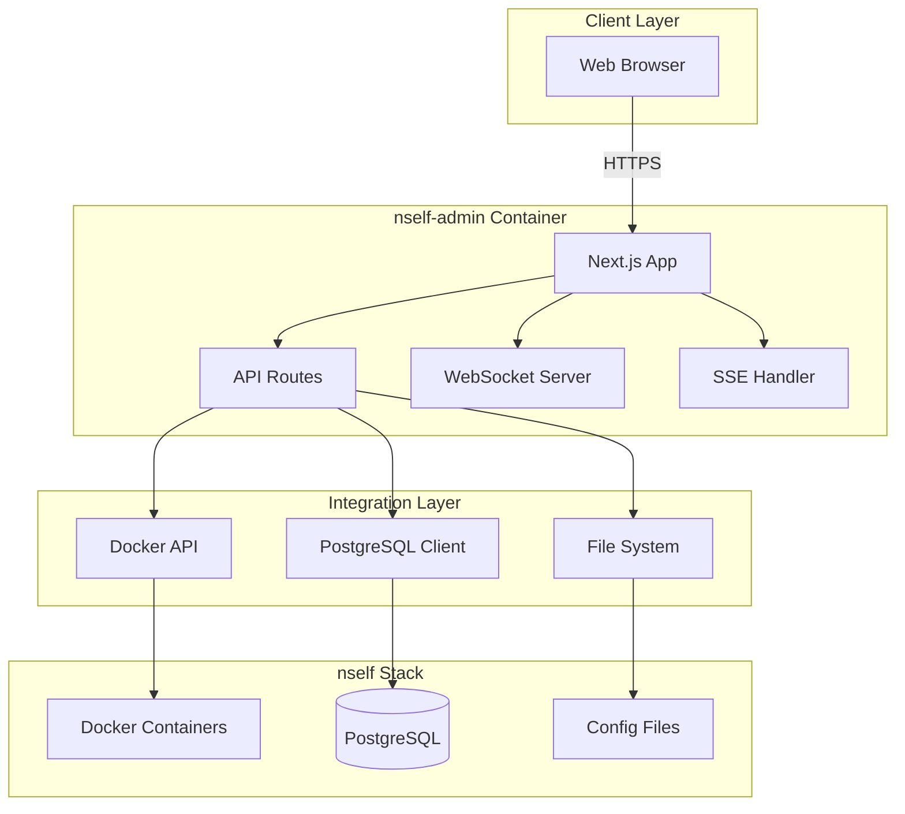
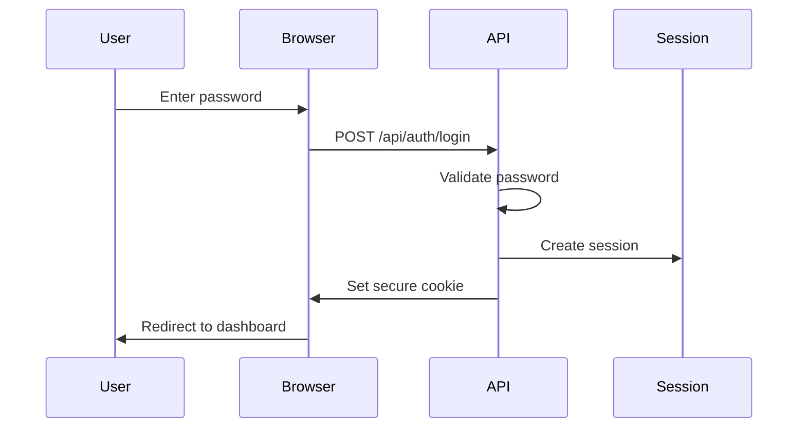

# Architecture Overview

## System Architecture

nself-admin follows a modern, containerized architecture designed for scalability, maintainability, and ease of deployment.



## Application Structure

### Frontend Architecture

The frontend uses Next.js 15 with the App Router for optimal performance and SEO.

```
src/app/
├── (main)/          # Main layout group
│   ├── dashboard/   # Dashboard pages
│   ├── services/    # Service management
│   ├── database/    # Database tools
│   └── config/      # Configuration
├── api/            # API routes
├── login/          # Authentication
└── layout.tsx      # Root layout
```

### Component Architecture

Components follow a hierarchical structure with clear separation of concerns:

```
src/components/
├── ui/             # Base UI components
├── services/       # Service-specific components
├── dashboard/      # Dashboard components
└── shared/         # Shared/common components
```

### State Management

We use Zustand for global state management with the following stores:

```typescript
// Project Store Structure
interface ProjectStore {
  // Project state
  projectStatus: ProjectStatus
  projectInfo: ProjectInfo

  // Metrics & monitoring
  systemMetrics: SystemMetrics
  containerStats: ContainerStats[]

  // Actions
  checkProjectStatus: () => Promise<void>
  fetchMetrics: () => Promise<void>
  updateConfig: (config: Config) => Promise<void>
}
```

## API Architecture

### RESTful Endpoints

All API routes follow RESTful conventions:

```
GET    /api/docker/containers      # List containers
POST   /api/docker/containers/:id  # Container actions
GET    /api/system/metrics         # System metrics
GET    /api/project/status         # Project status
POST   /api/config/env             # Update config
```

### Real-time Communication

#### WebSocket Events

```javascript
// Server -> Client Events
socket.emit('container:update', data)
socket.emit('logs:stream', data)
socket.emit('metrics:update', data)

// Client -> Server Events
socket.emit('logs:subscribe', containerId)
socket.emit('metrics:subscribe', interval)
```

#### Server-Sent Events

```javascript
// Build progress updates
eventSource.addEventListener('build:progress', (e) => {
  const progress = JSON.parse(e.data)
  updateBuildProgress(progress)
})
```

## Security Architecture

### Authentication Flow



### Security Layers

1. **Authentication**: Password-based with secure session cookies
2. **Authorization**: Admin-only access control
3. **Docker Socket**: Read-only by default, write requires explicit permission
4. **File System**: Scoped to project directory
5. **Network**: Isolated container network

## Data Flow

### Polling Service Architecture

```typescript
class SimplifiedPollingService {
  // Centralized data fetching
  private async fetchData() {
    const [metrics, containers, status] = await Promise.all([
      fetch('/api/system/metrics'),
      fetch('/api/docker/containers'),
      fetch('/api/project/status'),
    ])

    // Update global store
    store.updateCachedData({
      systemMetrics: metrics.data,
      containerStats: containers.data,
      projectStatus: status.data,
    })
  }
}
```

### Data Update Flow

1. **Polling Service** fetches data every 2 seconds
2. **Global Store** updates with new data
3. **React Components** re-render via Zustand subscriptions
4. **UI Updates** reflect real-time changes

## Docker Integration

### Container Management

```typescript
// Docker API Integration
class DockerService {
  private docker: Dockerode

  async listContainers() {
    return this.docker.listContainers({ all: true })
  }

  async startContainer(id: string) {
    const container = this.docker.getContainer(id)
    return container.start()
  }

  async streamLogs(id: string) {
    const container = this.docker.getContainer(id)
    return container.logs({
      follow: true,
      stdout: true,
      stderr: true,
    })
  }
}
```

### Volume Mounts

```yaml
volumes:
  - /var/run/docker.sock:/var/run/docker.sock # Docker API
  - ./:/project # Project files
  - nself-admin-data:/data # Persistent data
```

## Build & Deployment

### Multi-Stage Docker Build

```dockerfile
# Stage 1: Dependencies
FROM node:20-alpine AS deps
# Install production dependencies

# Stage 2: Builder
FROM node:20-alpine AS builder
# Build Next.js application

# Stage 3: Runner
FROM node:20-alpine AS runner
# Minimal production image
```

### Build Optimization

- **Standalone Build**: Next.js standalone output for smaller images
- **Layer Caching**: Optimized Dockerfile for faster rebuilds
- **Multi-Architecture**: Support for amd64, arm64, and armv7

## Performance Considerations

### Frontend Optimization

- **Code Splitting**: Automatic with Next.js App Router
- **Image Optimization**: Next.js Image component
- **Font Optimization**: Next.js Font loading
- **CSS**: Tailwind CSS with PurgeCSS

### Backend Optimization

- **Connection Pooling**: PostgreSQL connection pool
- **Request Debouncing**: Prevent API spam
- **Caching**: In-memory caching for frequently accessed data
- **Streaming**: Efficient log and metric streaming

## Monitoring & Observability

### Health Checks

```typescript
// Health check endpoint
GET /api/health

Response: {
  status: 'healthy' | 'degraded' | 'unhealthy',
  checks: {
    docker: boolean,
    filesystem: boolean,
    memory: boolean,
    network: boolean
  },
  resources: {
    memory: { used, total, percentage },
    cpu: { usage }
  }
}
```

### Logging

- **Application Logs**: Structured JSON logging
- **Container Logs**: Real-time streaming via Docker API
- **Error Tracking**: Centralized error handling

## Scalability

### Horizontal Scaling

While typically run as a single instance, nself-admin can be scaled horizontally with:

- **Shared Session Store**: Redis for session management
- **WebSocket Clustering**: Socket.io Redis adapter
- **Load Balancing**: Traefik or Nginx

### Resource Management

- **Memory Limits**: Configurable container memory limits
- **CPU Limits**: Configurable CPU quotas
- **Connection Limits**: PostgreSQL connection pooling
- **Request Limits**: Rate limiting on API endpoints
